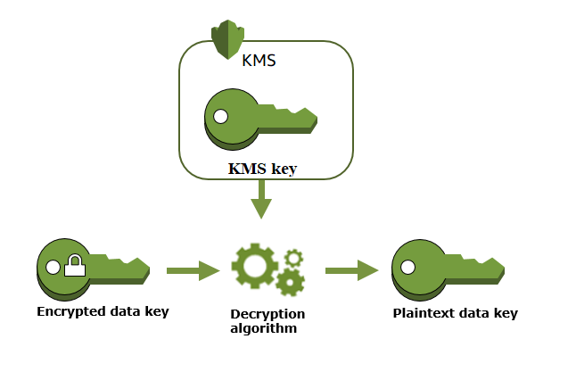
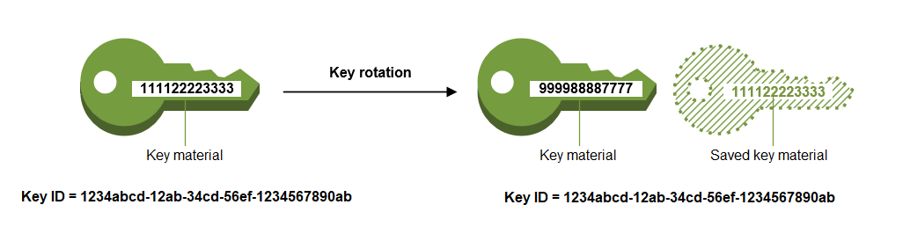

# AWS KMS Terraform module

## Overview

### Description

Terraform module which creates CMKs on AWS with all (or almost all) features provided by Terraform AWS provider.

### AWS KMS Documentation

* [AWS KMS](https://docs.aws.amazon.com/es_es/kms/)

This type of resources are supported:

* [KMS key](https://www.terraform.io/docs/providers/aws/r/kms_key.html#customer_master_key_spec)
* [KMS key alias](https://www.terraform.io/docs/providers/aws/r/kms_alias.html)

### Terraform versions

## Requirements

| Name | Version |
|------|---------|
| <a name="requirement_terraform"></a> [terraform](#requirement\_terraform) | >= 0.15 |

## Providers

| Name | Version |
|------|---------|
| <a name="provider_aws"></a> [aws](#provider\_aws) | >= 3.0.0, < 5.0.0 |

### configurations

These features of KMS configurations are supported:

* Create, edit and view symmetric and asymmetric CMKs.
* Enable and disable CMKs.
* Tag your CMKs for identification, automation, and cost tracking.
* Create, delete, list, and update aliases, which are friendly names for your CMKs.
* Delete CMKs to complete the key lifecycle.

## Architecture





## Usage

### Dependencies

The following resources must exist before the deployment can take place:

* AWS Account
* Role with the enough permissions to manage the module, AWS KMS uses a service-linked role named AWSServiceRoleForKeyManagementServiceCustomKeyStores. [Reference] <https://docs.aws.amazon.com/kms/latest/developerguide/using-service-linked-roles.html>

### Minimum Viable Configuration

> ⚠️ **Disclaimer**
>
> The following is an example of a minimum viable configuration, with optional parameters omitted, **intended to be used only in prototype or development environments**.
>
> Note that modifying this configuration later to include more parameters or modify existing ones may cause the resource to be recreated.

<table>
<tr style="vertical-align:top">
<td>

#### Example main.tf

```hcl
module "iac-ccoescf-kms-mvc" {
  source  = "github.com/santander-group-scfccoe/terraform-aws-iac-ccoescf-kms?ref=v4.0.1"

  #---------------------------------------
  # GLOBAL NAMING CONVENTION
  #---------------------------------------
  entity      = var.entity
  environment = var.environment
  app_name    = var.app_name
  sequence    = var.sequence

  #---------------------------------------
  # GLOBAL TAGGING CONVENTION
  #---------------------------------------
  mandatory_tags = var.mandatory_tags
}
```

</td>
<td>

#### Example terraform.tfvars

```hcl
#---------------------------------------
# GLOBAL NAMING CONVENTION
#---------------------------------------
entity      = "scf"
environment = "d1"
app_name    = "iacprd"
sequence    = "001"

#---------------------------------------
# GLOBAL TAGGING CONVENTION
#---------------------------------------
mandatory_tags = {
  # REQUIRED TAGS
  cost_center       = "CC-CGS"
  CIA               = "CAA"
  apm_functional    = "orbis_code_001"
  shared_cost       = "no"
  apm_technical     = "orbis_code_001"
  business_service  = "bs"
  service_component = "sc"
}
```

</td>
</tr>
</table>

---

### Configuration

<table>
<tr style="vertical-align:top">
<td>

#### Example main.tf

```hcl
module "iac-ccoescf-kms" {
  source  = "github.com/santander-group-scfccoe/terraform-aws-iac-ccoescf-kms?ref=v4.0.1"

  #---------------------------------------
  # GLOBAL NAMING CONVENTION
  #---------------------------------------
  entity          = var.entity
  environment     = var.environment
  app_name        = var.app_name
  function        = var.function
  sequence        = var.sequence
  parent_resource = var.parent_resource

  #---------------------------------------
  # GLOBAL TAGGING CONVENTION
  #---------------------------------------
  mandatory_tags = var.mandatory_tags
  custom_tags    = var.custom_tags

  #---------------------------------------
  # PRODUCT-SPECIFIC VARIABLES
  #---------------------------------------
  alias_name    = var.alias_name
  custom_policy = var.custom_policy
  key_usage     = var.key_usage
  is_enabled    = var.is_enabled
  is_symmetric  = var.is_symmetric
}
```

</td>
<td>

#### Example terraform.tfvars

```hcl
#---------------------------------------
# GLOBAL NAMING CONVENTION
#---------------------------------------
entity          = "cgs"
environment     = "d1"
app_name        = "iacprd"
function        = "gene"
sequence        = 01
parent_resource = {
  artifact_acronym = "as3"
  sequence         = 001
}

#---------------------------------------
# GLOBAL TAGGING CONVENTION
#---------------------------------------
  mandatory_tags = {
    # REQUIRED TAGS
    cost_center       = "CC-CGS"
    CIA               = "CAA"
    apm_functional    = "orbis_code_001"
    shared_cost       = "no"
    apm_technical     = "orbis_code_001"
    business_service  = "bs"
    service_component = "sc"
    # OPTIONAL TAGS
    product        = "PG09"
    description    = "kms"
    channel        = "IACPRD"
    tracking_code  = "iac"
  }

custom_tags = {
  extra_tag = "custom value tag"
}

#---------------------------------------
# PRODUCT-SPECIFIC VARIABLES
#---------------------------------------
alias_name    = "key001_for_s3_encryption"
custom_policy = {
  compose_mode = "Override"
  json         = <<EOT
{
    "Version": "2012-10-17",
    "Statement": [
        {
            "Sid": "Enable IAM User Permissions",
            "Effect": "Allow",
            "Principal": {
                "AWS": "arn:aws:iam::xxxxxxxxxx:root"
            },
            "Action": "kms:*",
            "Resource": "*"
        }
    ]
}
EOT
}
key_usage     = "ENCRYPT_DECRYPT"
is_enabled    = true
is_symmetric  = true
```

</td>
</tr>
</table>

## Inputs

| Name | Description | Type | Default | Required |
|------|-------------|------|---------|:--------:|
| <a name="input_app_name"></a> [app\_name](#input\_app\_name) | (Required, **Forces new resource**) App acronym of the resource. Used for Naming. (6 characters) | `string` | n/a | yes |
| <a name="input_entity"></a> [entity](#input\_entity) | (Required, **Forces new resource**) Santander entity code. Used for Naming. (3 characters) | `string` | n/a | yes |
| <a name="input_environment"></a> [environment](#input\_environment) | (Required, **Forces new resource**) The abbreviation for the target environment. | `string` | n/a | yes |
| <a name="input_mandatory_tags"></a> [mandatory\_tags](#input\_mandatory\_tags) | (Required) Map of strings to be assigned as resource tags, complaining Santander Group Tagging Standard. See: <https://confluence.alm.europe.cloudcenter.corp/pages/viewpage.action?spaceKey=arqdevops&title=Tags> | `map(string)` | n/a | yes |
| <a name="input_sequence"></a> [sequence](#input\_sequence) | (Required, **Forces new resource**) Sequence number of the resource. Used for Naming. (1 to 3 digits) | `number` | n/a | yes |
| <a name="input_alias_name"></a> [alias\_name](#input\_alias\_name) | (Optional, **Forces new resource**) Name alias of the KMS. | `string` | `null` | no |
| <a name="input_custom_policy"></a> [custom\_policy](#input\_custom\_policy) | (Optional) A policy JSON document and the strategy to merge with the default key policy.<br>  Although this is a key policy, not an IAM policy, an `aws_iam_policy_document`, in the form that designates a principal, can be used.<br>  If you do not provide a key policy, AWS KMS attaches a default key policy to the CMK.<br>  Set `compose_mode` to `Merge` if both default key policy and custom\_policy statements should be merged.<br>  Set `compose_mode` to `Override` if custom\_policy statements override the default key policy. | <pre>object(<br>    {<br>      compose_mode = string # The merge strategy with the default key policy.<br>      json         = string # A valid policy JSON document<br>    }<br>  )</pre> | `null` | no |
| <a name="input_custom_tags"></a> [custom\_tags](#input\_custom\_tags) | (Optional) Additional tags. If some key matches one of the mandatory tags, its value shall be ignored. | `map(string)` | `{}` | no |
| <a name="input_function"></a> [function](#input\_function) | (Optional, **Forces new resource**) App function of the resource. Used for Naming. (4 characters) | `string` | `"gene"` | no |
| <a name="input_is_enabled"></a> [is\_enabled](#input\_is\_enabled) | (Optional) Specifies whether the key is enabled. | `bool` | `true` | no |
| <a name="input_is_symmetric"></a> [is\_symmetric](#input\_is\_symmetric) | (Optional, **Forces new resource**) If true, KMS will be symmetric, otherwise it will be (RSA\_2048) | `bool` | `true` | no |
| <a name="input_key_usage"></a> [key\_usage](#input\_key\_usage) | (Optional, **Forces new resource**) [ENCRYPT\_DECRYPT or SIGN\_VERIFY] | `string` | `"ENCRYPT_DECRYPT"` | no |
| <a name="input_parent_resource"></a> [parent\_resource](#input\_parent\_resource) | (Optional) Naming info, mainly artifact acronym and sequence number, of the parent resource that this artifact depends on or is associated to.<br>See: [CV-002](https://confluence.alm.europe.cloudcenter.corp/display/ARCHCLOUD/Naming+and+Tagging+Building+Block#NamingandTaggingBuildingBlock-CV-002VirtualMachinesassociatedresourcesnamingstandard)<br>and [CV-004](https://confluence.alm.europe.cloudcenter.corp/display/ARCHCLOUD/Naming+and+Tagging+Building+Block#NamingandTaggingBuildingBlock-CV-004Otherassociatedresourcesnamingstandard)<br>(`artifact_acronym`: 3 characters \| `sequence`: 3 digits) | <pre>object(<br>    {<br>      artifact_acronym = string<br>      sequence         = number<br>    }<br>  )</pre> | `null` | no |

## Outputs

| Name | Description |
|------|-------------|
| <a name="output_artifact_acronym"></a> [artifact\_acronym](#output\_artifact\_acronym) | Acronym of the curated module product. |
| <a name="output_kms_alias_arn"></a> [kms\_alias\_arn](#output\_kms\_alias\_arn) | Alias arn of the KMS |
| <a name="output_kms_alias_name"></a> [kms\_alias\_name](#output\_kms\_alias\_name) | Alias name of the KMS. Useful to retrieve KMS data source. |
| <a name="output_kms_arn"></a> [kms\_arn](#output\_kms\_arn) | arn of the KMS created |
| <a name="output_kms_id"></a> [kms\_id](#output\_kms\_id) | ID of the KMS created |
| <a name="output_kms_name"></a> [kms\_name](#output\_kms\_name) | Unique name of the KMS (present in tags) |
| <a name="output_kms_policy_document"></a> [kms\_policy\_document](#output\_kms\_policy\_document) | JSON formatted KMS policy document applied to product key. |
